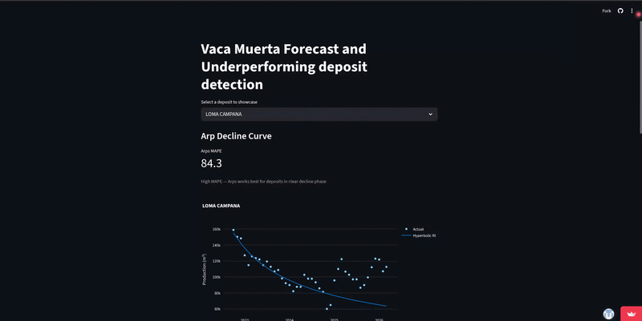

# Vaca Muerta — Oil & Gas Production Forecast & Underperformance Detection

**Author:** Nahuel Ignacio Fuentes  
**Data:** Argentina's Secretary of Energy (datos.energia.gob.ar)  
**Period:** 2006–2026  
**Basin:** Cuenca Neuquina  

## Project Goal
Analyze unconventional oil and gas production across deposits in the Neuquén 
basin, forecast future production, and automatically flag underperforming wells 
by comparing actual production against model expectations.

## Demo

[**Try the live app**](https://vaca-muerta-underperformance-forecast.streamlit.app/)

## Business Use Case
In O&G operations, identifying underperforming wells early allows operators to 
intervene before significant production losses occur. This project builds a 
data-driven baseline of expected production per well and flags anomalies 
automatically.

## What was built
- Exploratory data analysis: well locations, production by company, deposit comparisons and water cut trends
- Arps decline curve fitting (hyperbolic + exponential) for top producing deposits
- Prophet time series forecasting with train/test evaluation
- Underperformance detection combining production threshold and rising water cut signals
- Interactive Streamlit dashboard with deposit selector and MAPE metric cards

## Results

### Arps Decline Curve — Estación Fernández Oro

### Prophet Forecast — Loma Campana  

### Underperformance Detection — Sierras Blancas

### Model Comparison
| Deposit | Arps MAPE | Prophet MAPE | Winner |
|---|---|---|---|
| Loma Campana | 84.3% | 26.9% | Prophet |
| Estación Fernández Oro | 3.0% | 27.3% | Arps |
| Cruz de Lorena | N/A | 129.4% | — |
| Sierras Blancas | N/A | 51.1% | Prophet |

> **N/A:** Arps decline curve fitting requires a clear hyperbolic or exponential
> decline trend. Cruz de Lorena and Sierras Blancas show irregular or
> early-stage production patterns that don't meet this condition,
> making Arps fitting unreliable for these deposits.

## Roadmap
- [x] Prophet time series forecasting
- [x] Baseline vs ML comparison (Arps vs Prophet)
- [x] Evaluation metrics (RMSE, MAE)
- [x] Underperformance detection and flagging system
- [x] Live demo using Streamlit for interacting with different deposits

## Stack
- Python, Pandas, NumPy
- Plotly, Matplotlib
- Scipy (curve fitting)
- Prophet

## Data Source
[datos.energia.gob.ar](http://datos.energia.gob.ar)
