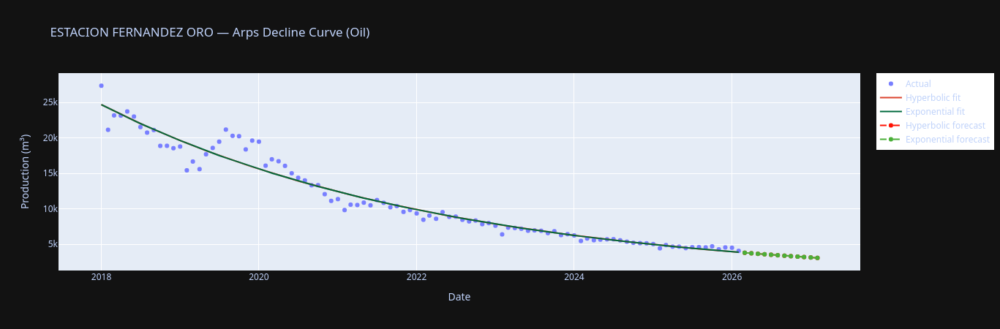
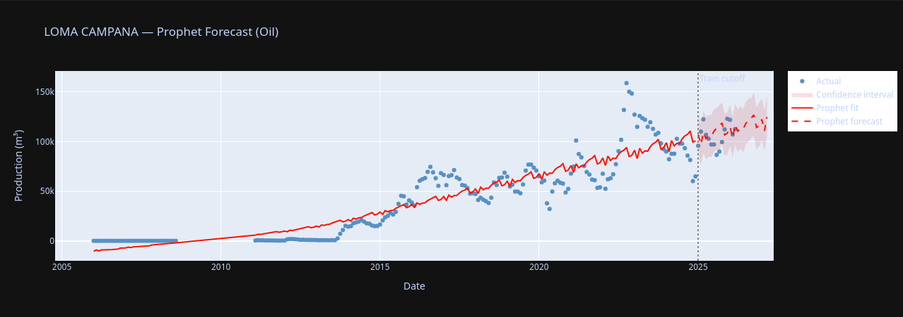
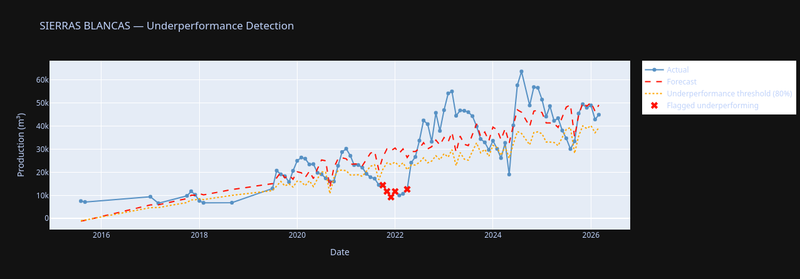

# Vaca Muerta — Oil & Gas Production Forecast & Underperformance Detection

**Author:** Nahuel Ignacio Fuentes  
**Data:** Argentina's Secretary of Energy (datos.energia.gob.ar)  
**Period:** 2006–2026  
**Basin:** Cuenca Neuquina  

## Project Goal
Analyze unconventional oil and gas production across deposits in the Neuquén 
basin, forecast future production, and automatically flag underperforming wells 
by comparing actual production against model expectations.

## Business Use Case
In O&G operations, identifying underperforming wells early allows operators to 
intervene before significant production losses occur. This project builds a 
data-driven baseline of expected production per well and flags anomalies 
automatically.

## Current State
- Exploratory analysis: well locations, production by company,
  deposit comparisons, water cut trends
- Arps decline curve fitting (hyperbolic + exponential)
  for top producing deposits
- 12-month production forecast for top producing deposits

## Results

### Arps Decline Curve — Estación Fernández Oro

### Prophet Forecast — Loma Campana  

### Underperformance Detection — Sierras Blancas

### Model Comparison
| Deposit | Arps MAPE | Prophet MAPE | Winner |
|---|---|---|---|
| Loma Campana | 84.3% | 26.9% | Prophet |
| Estación Fernández Oro | 3.0% | 27.3% | Arps |
| Cruz de Lorena | N/A | 129.4% | — |
| Sierras Blancas | N/A | 51.1% | Prophet |

## Roadmap
- [x] Prophet time series forecasting
- [x] Baseline vs ML comparison (Arps vs Prophet)
- [x] Evaluation metrics (RMSE, MAE)
- [x] Underperformance detection and flagging system

## Stack
- Python, Pandas, NumPy
- Plotly, Matplotlib
- Scipy (curve fitting)
- Prophet, PyTorch (coming)

## Data Source
[datos.energia.gob.ar](http://datos.energia.gob.ar)
